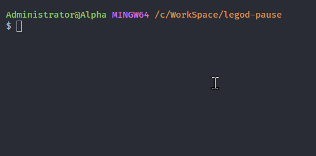

## 原项目
https://github.com/6yy66yy/legod-auto-pause

雷神加速器时长自动暂停(脚本)

## 脚本和原项目有何不同
用途不同，这个仅仅是用于开机任务/关机任务/定时任务的脚本。




## 使用方式
第一次运行会要求手机号和密码，登录信息生成config.json

> 有Deno环境的Linux只需要main.js就能跑了

## 编译
```
deno compile --allow-write --allow-read --allow-net ./main.js --is_compiled
```
## FAQ
### 如何设置windows关机任务
参考回答 https://stackoverflow.com/a/12434923